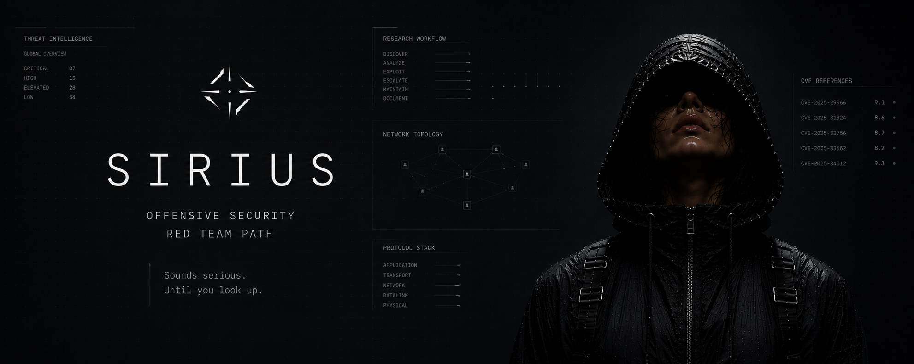

  

---

> *"SIRIUS| it sounds serious. until You look up."*

---

## ⚡ whoami
▸ Web Application Penetration Tester — in progress

▸ Future: AI Red Teaming

▸ Currently: Mastering Python for Security (Networking & Linux completed ✅)

▸ Every commit here is a real step, not a tutorial screenshot

---

## 🗺️ The Journey

| Phase | Focus | Status |
|-------|-------|--------|
| 01 | Networking Fundamentals | ✅ Done |
| 02 | Linux + OverTheWire Bandit | ✅ Done |
| 03 | Python for Security | 🔄 In Progress |
| 04 | Web App Security — PortSwigger | ⬜ Up Next |
| 05 | API Security + Burp Suite | ⬜ |
| 06 | OSCP-level Machines | ⬜ |

---

## 📂 What you'll find here

- `sirius-linux-foundations/` — Linux basics and OverTheWire Bandit fully documented
- `python-scripts/` — tools I built, not tutorials I watched
- `htb-writeups/` — HackTheBox machines, documented properly
- `portswigger-labs/` — every lab, every vulnerability class

---

## 🧠 Current focus
▸ TCM Security — Practical Ethical Hacking (Python Module)

▸ Python for Security & Automation
